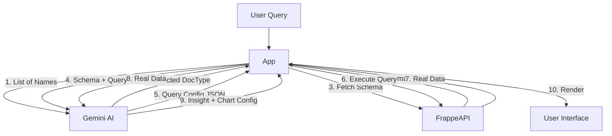

# System Architecture

## AI Agent Pipeline

The core intelligence of FrappeInsight relies on a chain of specific prompts sent to the Gemini 2.5 Flash model. We do not feed the entire database to the AI. Instead, we use a "Tool Use" pattern.

### Step 1: Schema Discovery (`identifyRelevantDocTypes`)

**Problem:** A Frappe ERP might have hundreds of DocTypes. Sending all schemas to the LLM is too expensive and exceeds context windows.
**Solution:**
1.  We fetch a lightweight list of **only names** of all DocTypes (`['Sales Invoice', 'Item', 'Customer', ...]`).
2.  We ask the AI: *"Based on the user query 'Show me revenue', which DocTypes are relevant?"*
3.  The AI returns: `['Sales Invoice']`.

### Step 2: Query Generation (`generateFrappeQueryConfig`)

**Problem:** We need to query the database securely without executing raw SQL on the client.
**Solution:**
1.  We fetch the **full schema** (field names, types) only for the DocTypes identified in Step 1.
2.  We provide this specific schema to the AI alongside the User Query and Long-term Memory.
3.  The AI generates a JSON object compatible with `frappe.client.get_list`:
    ```json
    {
      "doctype": "Sales Invoice",
      "fields": ["posting_date", "grand_total"],
      "filters": { "docstatus": 1 }
    }
    ```

### Step 3: Insight & Visualization (`generateInsight`)

**Problem:** Raw data needs to be interpreted and plotted.
**Solution:**
1.  The app executes the query generated in Step 2 against the Frappe API.
2.  The **Raw JSON Data** is fed back to the AI.
3.  The AI is instructed to:
    -   Analyze the data textually.
    -   Generate a `visualization` object (specifying Chart Type, X-Axis, Series).
    -   Suggest follow-up questions.

## Data Flow Diagram



## Security Considerations

1.  **API Keys:** The Gemini API key is stored in `process.env`. In production (Frappe App), this should be proxied via a backend method to avoid exposing it in the client bundle.
2.  **Database Access:** The app uses standard Frappe permissions. The `get_list` call will only return data the logged-in user is allowed to see.
3.  **Sanitization:** The app does not execute raw SQL. It relies on the Frappe ORM filter object, which handles SQL injection prevention.
